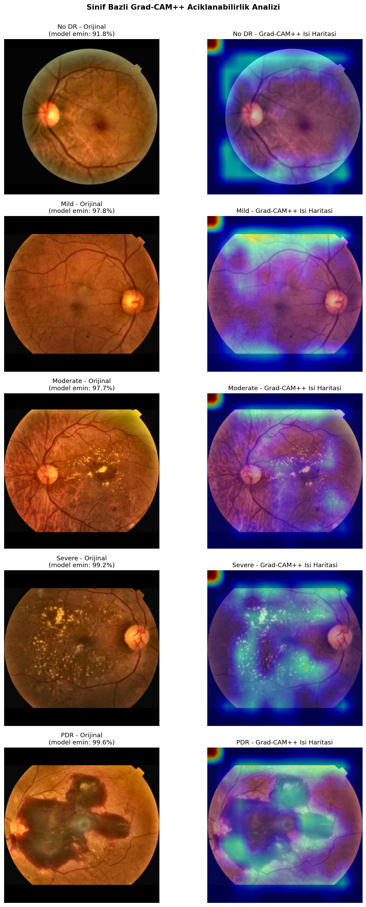
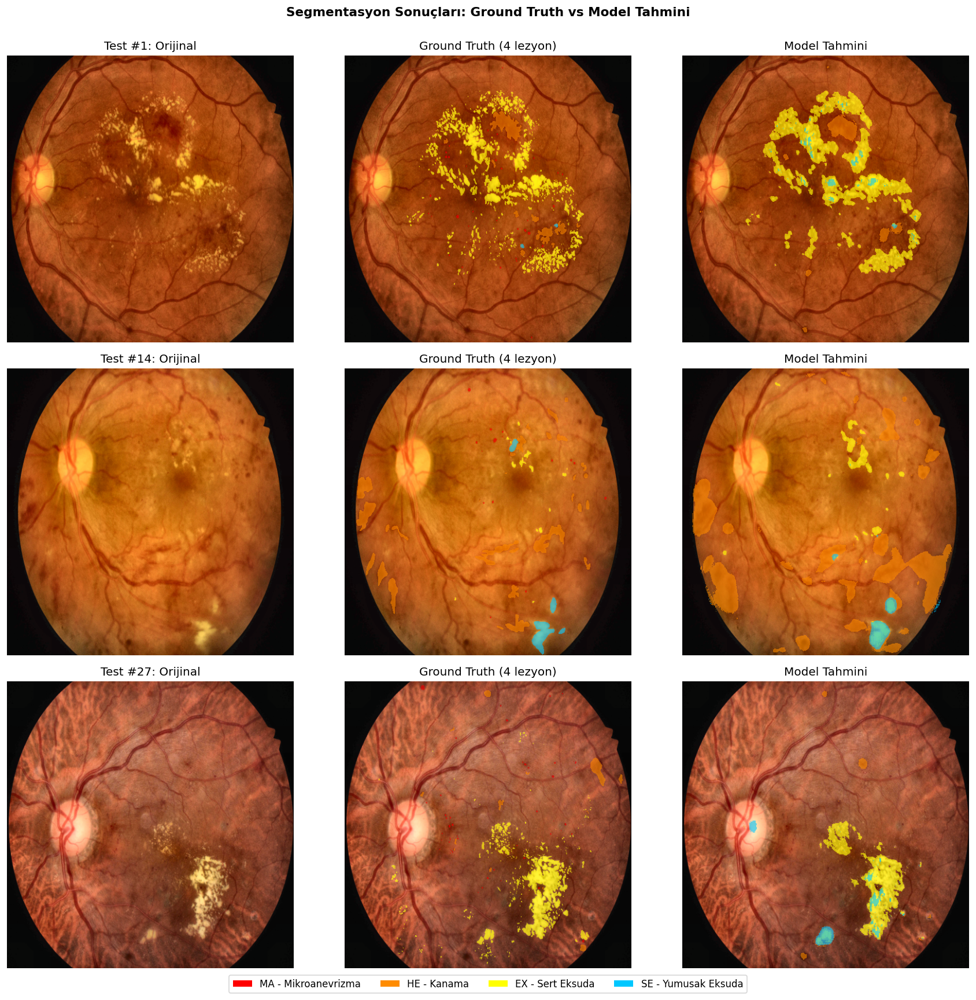
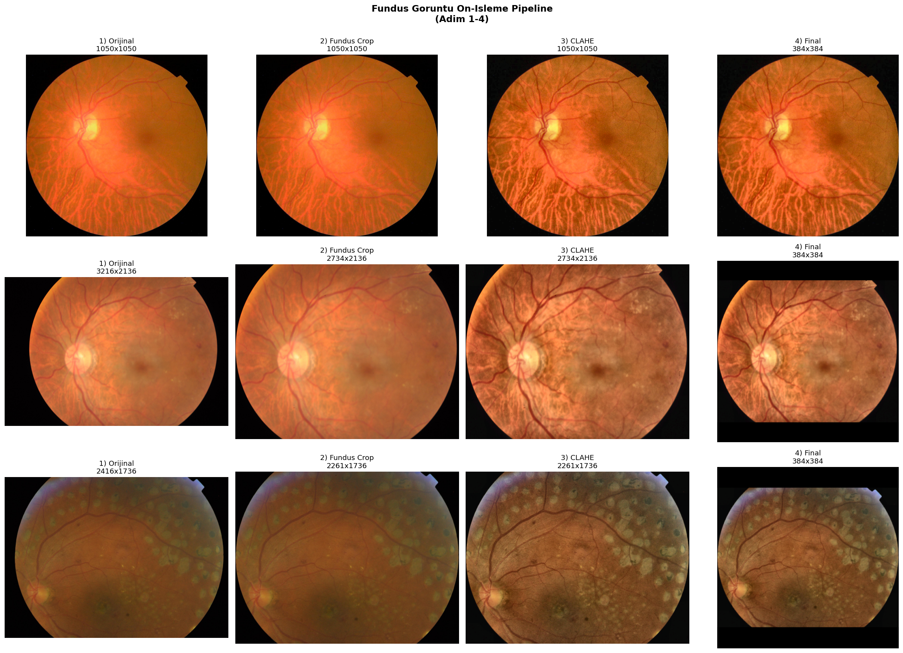

<div align="center">

# Diyabetik Retinopati Analizi için Derin Öğrenme Tabanlı Çoklu Görev Sistemi

**Fundus görüntülerinden DR şiddet sınıflandırması, lezyon segmentasyonu ve karar açıklanabilirliği sunan uçtan uca bir derin öğrenme sistemi**

[](https://www.python.org/)
[](https://pytorch.org/)
[](LICENSE)
[](#sonuçlar)
[](https://www.btu.edu.tr)

</div>

---

## Genel Bakış

Diyabetik retinopati (DR), dünya genelinde **537 milyon** diyabet hastasının yaklaşık üçte birini etkileyen ve çalışma yaşındaki yetişkinler arasında **görme kaybının en yaygın nedenlerinden biri** olan mikrovasküler bir komplikasyondur. Erken teşhis edilirse tedavi şansı yüksek olmasına rağmen, oftalmolog yetersizliği ve manuel inceleme süreçleri tarama programlarının önündeki en büyük engellerdir.

Bu projede bu probleme yönelik üç eksenli bir çözüm geliştirilmiştir:

| Modül | Mimari | Görev |
|---|---|---|
| **Sınıflandırıcı** | EfficientNet-B3 | 5-sınıflı DR şiddet tanılaması (No DR, Mild, Moderate, Severe, PDR) |
| **Segmenter** | U-Net + EfficientNet-B0 encoder | 4 lezyon tipinin piksel düzeyinde tespiti (MA, HE, EX, SE) |
| **Açıklayıcı** | Grad-CAM++ | Modelin karar verdiği bölgelerin ısı haritası ile görselleştirilmesi |

---

## Öne Çıkan Sonuçlar

<table>
<tr>
<td width="50%">

### Sınıflandırma Başarısı
**Quadratic Kappa: 0.885**

APTOS 2019 Kaggle yarışmasında üst %10'a denk gelen performans.

</td>
<td width="50%">

### Segmentasyon Başarısı
**Ortalama Dice: 0.486** (MA hariç)

Sert eksuda: 0.59 · Kanama: 0.46 · Yumuşak eksuda: 0.40

</td>
</tr>
<tr>
<td width="50%">

### Açıklanabilirlik
Grad-CAM++ ısı haritaları modelin **gerçek lezyon bölgelerine** baktığını doğruluyor.

</td>
<td width="50%">

### Dürüst Sınırlılık Raporu
Domain shift ve mikroanevrizma çözünürlük problemleri açıkça raporlanmıştır.

</td>
</tr>
</table>

---

## Görsel Sonuçlar

### Grad-CAM Açıklanabilirlik
Model her sınıf için karar verirken hangi bölgelere baktığını gösterir. Lezyon içeren sınıflarda ısı haritası gerçek lezyon konumlarında yoğunlaşır.

<div align="center">

</div>

### Lezyon Segmentasyonu
Ground truth maskeler ile model tahminlerinin karşılaştırması. Sert eksudalar (sarı), kanamalar (turuncu) ve yumuşak eksudalar (mavi) yüksek doğrulukla segmente edilmektedir.

<div align="center">

</div>

### Ön İşleme Pipeline
Ham fundus görüntüsünden modele uygun girdiye dönüşüm: siyah arka plan kırpılır, CLAHE ile kontrast artırılır, kare formatta yeniden boyutlandırılır.

<div align="center">

</div>

---

## Sonuç Tabloları

### Sınıflandırma Performansı

| Veri Seti | Accuracy | F1-Macro | Quadratic Kappa |
|---|:---:|:---:|:---:|
| APTOS Validasyon | 0.808 | 0.656 | **0.885** |
| IDRiD External Test | 0.214 | 0.156 | 0.146 |

> External test setindeki dramatik düşüş, farklı kamera ve klinik koşullarından kaynaklanan **domain shift** probleminin somut göstergesidir.

### Segmentasyon Performansı (IDRiD)

| Lezyon | Dice | IoU | Eğitim Örneği |
|---|:---:|:---:|:---:|
| Sert Eksuda (EX) | 0.593 | 0.422 | 54 |
| Kanama (HE) | 0.463 | 0.301 | 53 |
| Yumuşak Eksuda (SE) | 0.402 | 0.252 | 26 |
| Mikroanevrizma (MA) | 0.000 | 0.000 | 54 |
| **Ortalama (MA hariç)** | **0.486** | **0.325** | — |

> MA başarısızlığı 512×512 çözünürlüğe küçültme sırasında lezyonların piksel altına düşmesinden kaynaklanır. Sınırlılıklar bölümünde detaylı tartışılmıştır.

---

## Hızlı Başlangıç

### 1. Klonla ve kur

```bash
git clone https://github.com/cantekinn/DR-Analysis-System.git
cd DR-Analysis-System
pip install -r requirements.txt
```

### 2. Veri setlerini indir

| Veri Seti | Kaynak | Boyut |
|---|---|---|
| APTOS 2019 | [Kaggle](https://www.kaggle.com/competitions/aptos2019-blindness-detection) | 3.662 görüntü |
| IDRiD | [Kaggle](https://www.kaggle.com/datasets/aaryapatel98/indian-diabetic-retinopathy-image-dataset) | 597 görüntü |

İndirilen veri setlerini `datasets/APTOS/` ve `datasets/IDRiD/` altına yerleştir.

### 3. Eğitilmiş modelleri indir

[**Releases**](https://github.com/cantekinn/DR-Analysis-System/releases) sayfasından `.pth` dosyalarını indir ve `checkpoints/` klasörüne yerleştir.

### 4. Notebook'ları sırayla çalıştır

```
01_eda.ipynb           Keşifsel veri analizi
02_preprocessing.ipynb Ön işleme ve veri bölme
03_train_classifier   EfficientNet-B3 eğitimi (~21 dk T4)
04_train_segmenter    U-Net eğitimi (~63 dk T4)
05_gradcam            Açıklanabilirlik analizi
```

---

## Mimari

```
Fundus Görüntüsü (Variable Size, RGB)
        │
        ▼
┌────────────────────────────────┐
│   ÖN İŞLEME PIPELINE           │
│   Fundus Crop → CLAHE          │
│   → Square Pad → Resize        │
└────────────────────────────────┘
        │
        ├──────────────┐
        ▼              ▼
┌──────────────┐  ┌──────────────┐
│ Sınıflandırıcı│  │  Segmenter   │
│ EfficientNet  │  │  U-Net +     │
│      B3       │  │  EffNet-B0   │
│   384×384     │  │  512×512     │
└──────┬───────┘  └──────┬───────┘
       │                 │
       ▼                 ▼
   5-sınıf prob.    4-kanal maske
       │           (MA, HE, EX, SE)
       ▼
   Grad-CAM++
   Isı haritası
```

---

## Teknik Detaylar

<details>
<summary><b>Eğitim Hiperparametreleri</b> (genişlet)</summary>

| Parametre | Sınıflandırma | Segmentasyon |
|---|:---:|:---:|
| Model | EfficientNet-B3 | U-Net + EfficientNet-B0 |
| Parametre Sayısı | 10.7M | 6.25M |
| Girdi Boyutu | 384×384 | 512×512 |
| Batch Size | 32 | 4 |
| Epoch Sayısı | 20 | 60 |
| Optimizer | AdamW | AdamW |
| Başlangıç LR | 3e-4 | 1e-4 |
| Weight Decay | 1e-4 | 1e-5 |
| Scheduler | Warmup (2 ep) + Cosine | Warmup (3 ep) + Cosine |
| Kayıp Fonksiyonu | Weighted CE + Label Smooth | BCE + Dice (0.5 / 0.5) |
| Mixed Precision | Aktif | Aktif |
| Eğitim Süresi | 21 dk (Tesla T4) | 63 dk (Tesla T4) |

</details>

<details>
<summary><b>Ön İşleme Pipeline Detayları</b> (genişlet)</summary>

1. **Fundus Crop** — Ben Graham'ın 2015 Kaggle DR yarışmasında önerdiği teknik. Gri tonlamada piksel yoğunluğu > 7 olan bölge tespit edilip kırpılır.
2. **CLAHE** — LAB renk uzayında L kanalına `clipLimit=2.0`, `tileGridSize=(8,8)` parametreleriyle uygulanır.
3. **Zero-Padded Square Resize** — Kare formatta 384×384 (sınıflandırma) veya 512×512 (segmentasyon) hedeflenir.
4. **ImageNet Normalize** — `mean=[0.485, 0.456, 0.406]`, `std=[0.229, 0.224, 0.225]`.

</details>

<details>
<summary><b>Veri Artırma (Augmentation)</b> (genişlet)</summary>

Albumentations kütüphanesi kullanılarak şu augmentation'lar uygulanmıştır:

- Horizontal Flip (p=0.5)
- Vertical Flip (p=0.3)
- Rotate ±180° (p=0.7)
- ShiftScaleRotate (p=0.5)
- RandomBrightnessContrast (p=0.5)
- HueSaturationValue (p=0.4)
- GaussianBlur (p=0.2)

</details>

---

## Proje Yapısı

```
DR-Analysis-System/
│
├── notebooks/              7 adet Jupyter Notebook (EDA → Eğitim → Analiz)
├── src/                    7 modüler Python dosyası
├── reports/
│   ├── figures/            15 rapor figürü (eğitim eğrileri, CM, vb.)
│   └── *.json              Metrik geçmişleri
├── splits/                 Train/Val/Test bölünmüş CSV'ler
├── Rapor.docx              Final akademik rapor (Türkçe)
├── generate_report.py      Word rapor üreticisi
├── requirements.txt
└── README.md
```

---

## Sınırlılıklar (Dürüst Rapor)

Bu çalışma akademik dürüstlük ilkesiyle sınırlılıklarını açıkça raporlamaktadır:

### 1. Domain Shift
APTOS-IDRiD arasında Kappa **0.885'ten 0.146'ya** düşüş gözlemlendi. Farklı kamera (Topcon vs Kowa), aydınlatma ve görüntüleme protokolleri arasındaki fark, modelin gerçek klinik kullanım öncesinde **çoklu merkez verileri ile valide edilmesi gerektiğini** açıkça göstermektedir.

### 2. Mikroanevrizma Çözünürlüğü
4288×2848 piksellik orijinal görüntülerin 512×512'ye küçültülmesi mikroanevrizmaları (3-10 piksel) yok etmektedir. **Patch-tabanlı eğitim** (≥1024×1024) ve A100/A6000 sınıfı GPU gerekmektedir.

### 3. Donanım Kısıtlamaları
Google Colab T4 ücretsiz GPU (16 GB VRAM) ile geliştirildi. Profesyonel donanım maliyeti:
- Bulut (A100): saat başına 2-5 USD, tam çevrim 60-150 USD
- Lokal (RTX A6000): 4.500-5.500 USD
- Lokal (A100): 10.000-15.000 USD

Detaylı tartışma `Rapor.docx` Bölüm 5'te yer almaktadır.

---

## Kaynaklar

Rapor içinde 13 akademik referans (IEEE format) bulunmaktadır. Temel referanslar:

- Gulshan et al. (2016) — JAMA: Google DR detection çalışması
- Porwal et al. (2018) — Data: IDRiD veri seti
- Tan & Le (2019) — ICML: EfficientNet
- Ronneberger et al. (2015) — MICCAI: U-Net
- Selvaraju et al. (2017) — ICCV: Grad-CAM

---

## Yazar

**Can Tekin**
Elektrik-Elektronik Mühendisliği, Bursa Teknik Üniversitesi
[GitHub](https://github.com/cantekinn) · [LinkedIn](https://www.linkedin.com)

## Lisans

[MIT License](LICENSE) — eğitim ve araştırma amaçlı serbest kullanım.

---

<div align="center">

**Bu sistem akademik bir prototiptir ve klinik tanı için kullanılamaz.**

*Bursa Teknik Üniversitesi · Mühendislik ve Doğa Bilimleri Fakültesi · EEM0458 · 2025-2026 Bahar*

</div>
